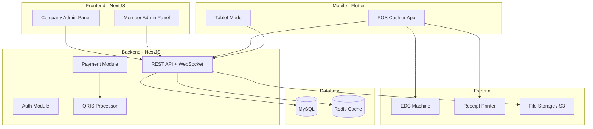
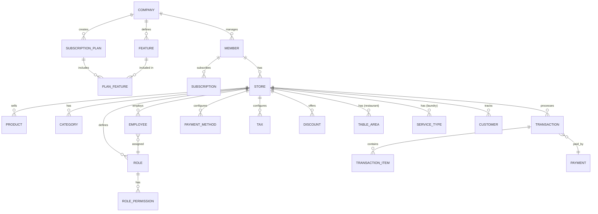
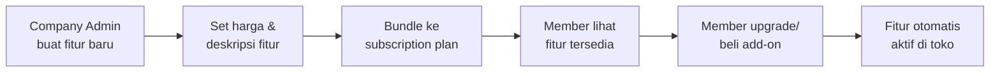
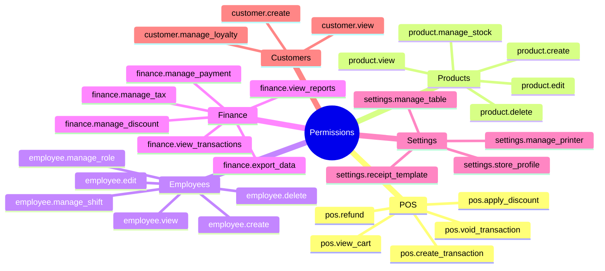
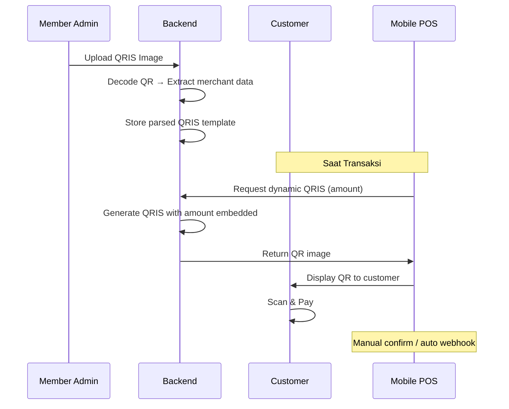

# MonetRAPOS - Multi-Business POS Application

Aplikasi POS (Point of Sale) untuk Restaurant, Laundry, dan berbagai jenis usaha lainnya. Terdiri dari 3 platform: Backend API (NestJS), Web Admin (NextJS), dan Mobile POS (Flutter).

---

## Architecture Overview



---

## Monorepo Structure

```
monetrapos/
├── apps/
│   ├── api/                    # NestJS Backend
│   ├── company-admin/          # NextJS - Company Admin
│   ├── member-admin/           # NextJS - Member Admin
│   └── mobile/                 # Flutter - POS Mobile
├── packages/
│   ├── shared-types/           # Shared TypeScript types
│   └── ui-components/          # Shared NextJS components
├── docker-compose.yml
├── package.json                # Root workspace
└── turbo.json                  # Turborepo config
```

---

## Database Schema (MySQL)



### Core Tables

| Table | Deskripsi |
|---|---|
| `companies` | Data perusahaan (platform owner) |
| `members` | User pemilik usaha yang berlangganan |
| `stores` | Toko/outlet milik member |
| `products` | Produk/jasa yang dijual |
| `categories` | Kategori produk |
| `variants` | Varian produk (size, topping, dll) |
| `taxes` | Konfigurasi pajak per toko |
| `discounts` | Diskon (%, nominal, voucher) |
| `transactions` | Transaksi penjualan |
| `transaction_items` | Item dalam transaksi |
| `payments` | Detail pembayaran |
| `payment_methods` | Metode bayar (QRIS, Cash, Transfer, EDC) |
| `qris_configs` | Konfigurasi QRIS per toko (image + parsed value) |
| `employees` | Karyawan toko (kasir, admin, manager) |
| `customers` | Data pelanggan (loyalty) |
| `audit_logs` | Log aktivitas |

### Permission & Role Tables

| Table | Deskripsi |
|---|---|
| `roles` | Role custom per toko (Owner, Admin, Kasir, Manager, dll) |
| `permissions` | Daftar semua permission yang tersedia |
| `role_permissions` | Mapping role ↔ permission (many-to-many) |
| `employee_roles` | Mapping employee ↔ role |

### Subscription & Feature Tables

| Table | Deskripsi |
|---|---|
| `features` | Semua fitur yang bisa dijual (QRIS, Multi-outlet, Loyalty, dll) |
| `subscription_plans` | Paket langganan (Biasa, VIP, Enterprise, Custom) |
| `plan_features` | Mapping paket ↔ fitur yang termasuk |
| `subscriptions` | Langganan aktif member |
| `subscription_history` | Riwayat upgrade/downgrade/pembayaran |

---

## Fitur per Platform

### 1. Company Admin (NextJS) — Manajemen Platform & Penjualan Fitur

| Modul | Fitur |
|---|---|
| **Dashboard** | Revenue overview, active members, grafik pertumbuhan, MRR/ARR |
| **Member Management** | CRUD member, approve/suspend, assign subscription tier |
| **🎯 Feature Marketplace** | CRUD fitur yang dijual, set harga per fitur, bundle fitur ke paket |
| **🎯 Subscription Plans** | Buat & kelola paket (Biasa/VIP/Enterprise/Custom), atur fitur per paket |
| **🎯 Upgrade Management** | Monitor upgrade/downgrade member, auto-provisioning fitur |
| **Transaction Monitoring** | Lihat semua transaksi member, filter by toko/periode |
| **Revenue Reports** | Pendapatan dari subscription, fitur add-on, growth metrics |
| **Announcements** | Broadcast notifikasi ke member |
| **Support Tickets** | Helpdesk untuk member |
| **Settings** | Company profile, admin users, platform config |

> [!IMPORTANT]
> **Feature Marketplace** — Company owner bisa menambah fitur baru kapan saja (misal: "WhatsApp Receipt", "Kitchen Display", "Loyalty Program"), set harga, lalu member tinggal upgrade/beli fitur tersebut.

#### Feature Marketplace Flow


#### Subscription Plan Examples
| Plan | Harga | Fitur Include |
|---|---|---|
| **Biasa** (Free) | Rp 0 | POS dasar, 1 outlet, 50 produk, Cash only |
| **VIP** | Rp 199K/bln | Unlimited produk, QRIS, Diskon, Laporan |
| **Enterprise** | Rp 499K/bln | Multi-outlet, Kitchen Display, Loyalty, API Access |
| **Custom** | Negotiable | Pilih fitur sesuai kebutuhan |

---

### 2. Member Admin (NextJS) — Manajemen Usaha

| Modul | Fitur |
|---|---|
| **Dashboard** | Sales today/weekly/monthly, top products, real-time orders |
| **Products** | CRUD produk, varian, foto, barcode/SKU, harga |
| **Categories** | Organisasi produk per kategori |
| **Inventory** | Stok tracking, low stock alerts, stock opname |
| **Tax** | Multiple tax configs (PPN 11%, PB1 10%, custom) |
| **Discounts** | Diskon per item/total, voucher code, happy hour, buy 1 get 1 |
| **Payment Settings** | Setup QRIS (upload → convert → auto-generate), bank transfer, cash |
| **Customers** | Database pelanggan, loyalty points, membership cards |
| **🎯 Role & Permission** | Buat role custom, atur permission per role, assign ke karyawan |
| **🎯 Employee Management** | CRUD karyawan, assign role, shift management |
| **Transaction History** | Detail transaksi, void/refund, export PDF/Excel |
| **🎯 Reports** | 15+ jenis laporan (lihat detail di bawah) |
| **Store Settings** | Profile toko, jam operasional, receipt template |
| **Multi-Outlet** | Kelola banyak cabang (VIP/Enterprise tier) |
| **🎯 Subscription** | Lihat paket aktif, upgrade, beli fitur add-on |

### 3. Mobile POS (Flutter) — Kasir

| Modul | Fitur |
|---|---|
| **Quick POS** | Grid/list produk, search, barcode scan, quick add |
| **Order Cart** | Edit qty, apply discount, add notes, customer info |
| **Payment** | Cash (hitung kembalian), QRIS (tampilkan QR), Transfer, Split payment |
| **EDC Integration** | Koneksi dengan mesin EDC via Bluetooth/USB |
| **Table Management** | (Restaurant) Peta meja, status occupied/available, merge table |
| **Kitchen Display** | (Restaurant) Order queue ke dapur, status: preparing → ready |
| **Laundry Queue** | (Laundry) Status: received → processing → done → picked up |
| **Receipt** | Print via thermal printer (Bluetooth/USB), share via WhatsApp |
| **Shift Management** | Clock in/out, cash drawer count |
| **Offline Mode** | Tetap bisa transaksi saat offline, sync saat online |
| **Tablet Mode** | Layout responsive untuk tablet 8-10 inch |

---

## 🔐 Role & Permission System (Detail)

Sistem permission yang canggih dan fleksibel — Owner bisa membuat role custom dengan permission granular.

### Default Roles

| Role | Deskripsi | Bisa Dibuat Owner? |
|---|---|---|
| **Owner** | Pemilik toko — akses semua fitur tanpa batasan | Otomatis (tidak bisa dihapus) |
| **Admin** | Admin toko — hampir semua akses KECUALI tambah karyawan & kelola role | Default |
| **Manager** | Manajer — akses laporan, void, diskon, tapi tidak bisa kelola karyawan | Default |
| **Kasir** | Kasir — hanya akses POS, transaksi, dan cetak struk | Default |
| **Custom** | Role custom buatan Owner | ✅ Ya |

### Permission Categories



### Permission Matrix (Default Roles)

| Permission | Owner | Admin | Manager | Kasir |
|---|---|---|---|---|
| **POS — Transaksi** | ✅ | ✅ | ✅ | ✅ |
| **POS — Void/Refund** | ✅ | ✅ | ✅ | ❌ |
| **POS — Apply Diskon** | ✅ | ✅ | ✅ | ❌ |
| **Produk — Lihat** | ✅ | ✅ | ✅ | ✅ |
| **Produk — CRUD** | ✅ | ✅ | ❌ | ❌ |
| **Produk — Kelola Stok** | ✅ | ✅ | ✅ | ❌ |
| **Karyawan — Lihat** | ✅ | ✅ | ✅ | ❌ |
| **Karyawan — CRUD** | ✅ | ❌ | ❌ | ❌ |
| **Karyawan — Kelola Role** | ✅ | ❌ | ❌ | ❌ |
| **Karyawan — Kelola Shift** | ✅ | ✅ | ✅ | ❌ |
| **Finance — Lihat Laporan** | ✅ | ✅ | ✅ | ❌ |
| **Finance — Export Data** | ✅ | ✅ | ❌ | ❌ |
| **Finance — Kelola Pajak** | ✅ | ✅ | ❌ | ❌ |
| **Finance — Kelola Diskon** | ✅ | ✅ | ✅ | ❌ |
| **Finance — Kelola Pembayaran** | ✅ | ✅ | ❌ | ❌ |
| **Settings — Semua** | ✅ | ✅ | ❌ | ❌ |
| **Customer — Kelola Loyalty** | ✅ | ✅ | ✅ | ❌ |

> [!TIP]
> Owner bisa **membuat role baru** (misal: "Kepala Kasir") dan memilih permission satu-per-satu via checklist UI. Role bisa di-assign ke banyak karyawan.

---

## 📊 Reporting System (Detail)

Sistem laporan lengkap untuk semua level — dari Company Admin sampai Member Owner.

### Company Admin Reports

| Laporan | Deskripsi | Visualisasi |
|---|---|---|
| **Platform Revenue** | Total pendapatan dari subscription & add-on | Line chart + summary cards |
| **Member Growth** | Pertumbuhan member baru per periode | Bar chart |
| **Churn Report** | Member yang cancel/downgrade | Funnel chart |
| **Feature Adoption** | Fitur mana yang paling banyak dibeli | Pie chart |
| **Top Members** | Member dengan transaksi terbanyak | Leaderboard table |
| **Subscription Report** | Distribusi member per paket | Donut chart |

### Member Admin Reports

| Laporan | Deskripsi | Export |
|---|---|---|
| **Sales Summary** | Ringkasan penjualan harian/mingguan/bulanan/tahunan | PDF, Excel |
| **Product Performance** | Produk terlaris, margin tertinggi, slow-moving | PDF, Excel |
| **Category Sales** | Penjualan per kategori | PDF, Excel |
| **Hourly Sales** | Penjualan per jam (peak hours analysis) | PDF |
| **Payment Method** | Breakdown pembayaran (Cash/QRIS/Transfer/EDC) | PDF, Excel |
| **Tax Report** | Total pajak terkumpul per periode | PDF, Excel |
| **Discount Report** | Total diskon yang diberikan, diskon per tipe | PDF |
| **Employee Performance** | Penjualan per kasir/karyawan | PDF, Excel |
| **Customer Report** | Top customer, frekuensi kunjungan, loyalty points | PDF |
| **Inventory Report** | Stok tersedia, stok menipis, riwayat stock opname | PDF, Excel |
| **Profit & Loss** | Estimasi laba rugi (revenue - HPP - diskon - pajak) | PDF, Excel |
| **Void & Refund** | Daftar transaksi void/refund beserta alasan | PDF |
| **Shift Report** | Kas awal/akhir per shift, selisih kas | PDF |
| **Outlet Comparison** | Perbandingan performa antar cabang (multi-outlet) | PDF, Excel |
| **Trend Analysis** | Tren penjualan YoY/MoM, forecast sederhana | Chart + PDF |

#### Report Dashboard Widgets
```
┌─────────────────────────────────────────────────────────┐
│  📊 Dashboard Laporan                                    │
├──────────┬──────────┬──────────┬──────────┐             │
│ Revenue  │ Transaksi│  Produk  │ Pelanggan│             │
│ Hari Ini │ Hari Ini │  Terjual │  Baru    │             │
│ Rp 5.2M  │   147    │   523    │    12    │             │
├──────────┴──────────┴──────────┴──────────┤             │
│ [Line Chart - Penjualan 30 Hari Terakhir] │             │
├───────────────────────┬───────────────────┤             │
│ [Pie - Payment Method]│ [Bar - Top 10    │             │
│  Cash: 45%            │  Produk Terlaris] │             │
│  QRIS: 35%            │                   │             │
│  Transfer: 15%        │                   │             │
│  EDC: 5%              │                   │             │
└───────────────────────┴───────────────────┘             │
└─────────────────────────────────────────────────────────┘
```


## Payment System Detail

### QRIS Flow


### Supported Payment Methods
| Method | Deskripsi |
|---|---|
| **Cash** | Input nominal, auto hitung kembalian |
| **QRIS** | Dynamic QR dari upload member, embed nominal transaksi |
| **Bank Transfer** | Tampilkan nomor rekening, manual confirm |
| **EDC** | Integrasi mesin EDC (debit/credit card) |
| **Split Payment** | Kombinasi beberapa metode (Cash + QRIS, dll) |
| **E-Wallet** | (Future) OVO, GoPay, DANA via API gateway |

---

## 💡 Saran Fitur Tambahan

### Fitur yang Sangat Disarankan

| Fitur | Deskripsi | Manfaat |
|---|---|---|
| **Offline Mode** | Transaksi tetap jalan tanpa internet, auto-sync | Krusial untuk usaha di area sinyal lemah |
| **Multi-Outlet** | 1 member kelola banyak cabang | Scalability untuk franchise |
| **Loyalty Program** | Point rewards, member card, stamp card digital | Meningkatkan repeat customer |
| **Kitchen Display System** | Layar dapur untuk order queue (restaurant) | Mengurangi human error |
| **Inventory Alert** | Notif stok menipis via push notification/WA | Mencegah kehabisan stok |
| **Shift & Cash Drawer** | Kelola shift kasir, hitung kas awal/akhir | Akuntabilitas karyawan |
| **WhatsApp Receipt** | Kirim struk via WhatsApp | Mengurangi kertas, modern |
| **Barcode/QR Scanner** | Scan barcode produk via kamera | Mempercepat input transaksi |
| **Multi-Language** | ID, EN untuk tourism area | Memperluas pasar |
| **Dark Mode** | Tema gelap untuk POS | Nyaman digunakan malam hari |

### Fitur Bisnis (Revenue Stream)

| Fitur | Deskripsi |
|---|---|
| **Subscription Tiers** | Free (1 outlet, 50 produk), Basic (unlimited produk), Pro (multi-outlet + QRIS), Enterprise (custom) |
| **White Label** | Member bisa custom branding receipt & app |
| **Marketplace Integration** | Sync dengan GoFood, GrabFood, ShopeeFood |
| **Accounting Export** | Export ke format Jurnal.id, Accurate, dll |
| **API Access** | Member bisa integrasi dengan sistem mereka sendiri |

### Fitur Keamanan

| Fitur | Deskripsi |
|---|---|
| **2FA** | Two-factor authentication untuk admin |
| **Audit Log** | Semua aktivitas tercatat (siapa, kapan, apa) |
| **Role-Based Access** | Granular permission per role |
| **Data Encryption** | Enkripsi data sensitif (payment info) |
| **Auto Backup** | Backup database otomatis harian |

---

## Tech Stack Detail

| Layer | Technology | Alasan |
|---|---|---|
| **Backend** | NestJS + TypeORM | Modular, TypeScript native, enterprise-grade |
| **Database** | MySQL 8.x | Reliable, widely supported, familiar |
| **Cache** | Redis | Session, queue, real-time data |
| **Frontend** | Next.js 14 (App Router) | SSR, API routes, excellent DX |
| **Mobile** | Flutter 3.x | Cross-platform, native performance |
| **Auth** | JWT + Refresh Token | Stateless, scalable |
| **File Storage** | MinIO / AWS S3 | QRIS images, product photos |
| **Queue** | BullMQ (Redis) | Background jobs (reports, notifications) |
| **Real-time** | WebSocket (Socket.IO) | Kitchen display, live orders |
| **Containerization** | Docker + Docker Compose | Easy deployment |
| **Report Engine** | PDFKit + ExcelJS | Generate PDF & Excel reports |

---

## Proposed Development Phases

### Phase 1 — Foundation (4-6 minggu)
- [ ] Project setup (monorepo, Docker, CI/CD)
- [ ] Database schema & migrations (MySQL)
- [ ] Auth system (register, login, JWT, refresh token)
- [ ] **Role & Permission engine** (CRUD roles, permission assignment)
- [ ] Company Admin: Dashboard + Member CRUD
- [ ] Company Admin: **Feature Marketplace + Subscription Plans**
- [ ] Member Admin: Dashboard + Product CRUD
- [ ] Member Admin: **Role & Permission management UI**

### Phase 2 — Core POS (4-6 minggu)
- [ ] Mobile POS: Product grid, cart, checkout
- [ ] Payment: Cash + QRIS upload & conversion
- [ ] Tax & Discount engine
- [ ] Transaction system
- [ ] Receipt printing (thermal printer)

### Phase 3 — Business Features (4-6 minggu)
- [ ] Restaurant: Table management, Kitchen Display
- [ ] Laundry: Service queue, status tracking
- [ ] Inventory management
- [ ] Employee & shift management
- [ ] Reports & analytics

### Phase 4 — Advanced (4-6 minggu)
- [ ] Offline mode (Flutter)
- [ ] EDC integration
- [ ] Multi-outlet support
- [ ] Loyalty program
- [ ] WhatsApp receipt
- [ ] Subscription & billing

---

## Verification Plan

### Automated Tests
- **Backend**: Unit tests per module using Jest (`npm run test`), E2E tests for critical flows (`npm run test:e2e`)
- **Frontend**: Component tests with React Testing Library, Cypress E2E for admin flows
- **Mobile**: Widget tests with Flutter test framework (`flutter test`)

### Manual Verification
- Browser testing of admin panels on Chrome/Firefox
- Mobile testing on physical Android/iOS devices & tablet
- EDC integration testing with actual hardware
- QRIS flow testing with real QR code upload → payment simulation
- Receipt printing with thermal printer

> [!IMPORTANT]
> Ini adalah proyek besar yang membutuhkan development bertahap (phased). Saya sarankan mulai dari **Phase 1** terlebih dahulu agar fondasi kuat sebelum menambah fitur kompleks.
